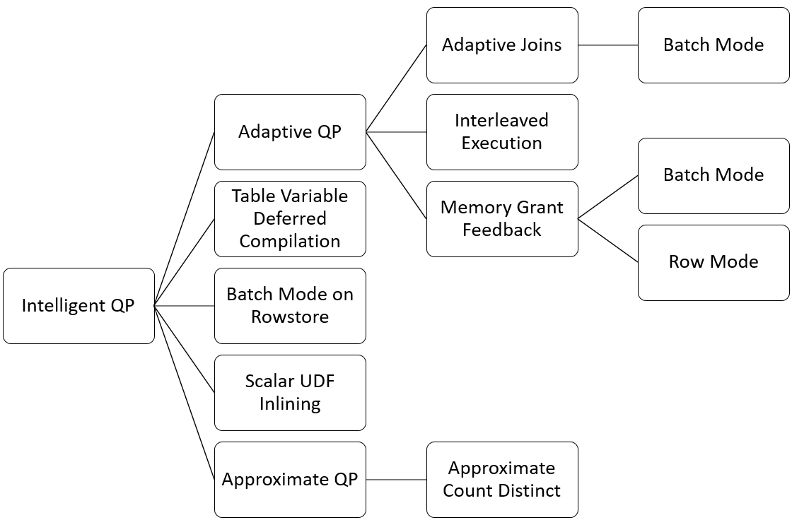
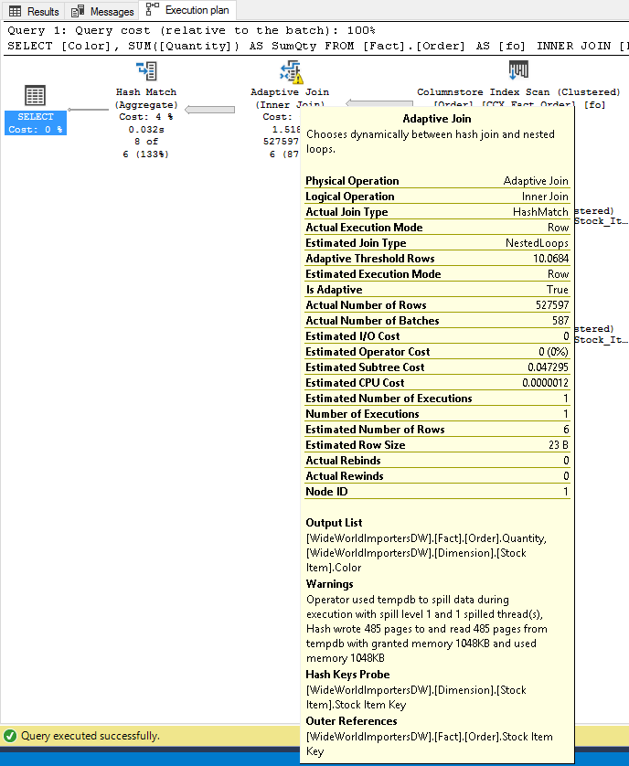
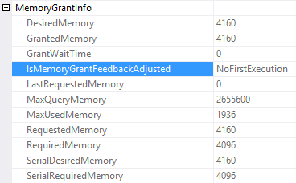
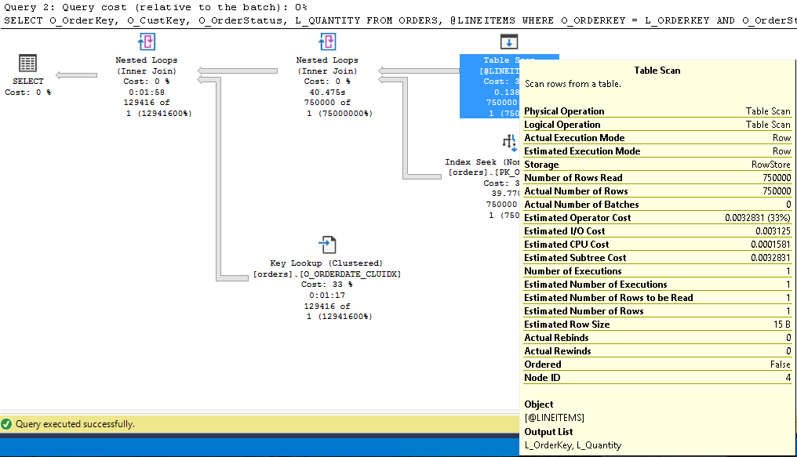
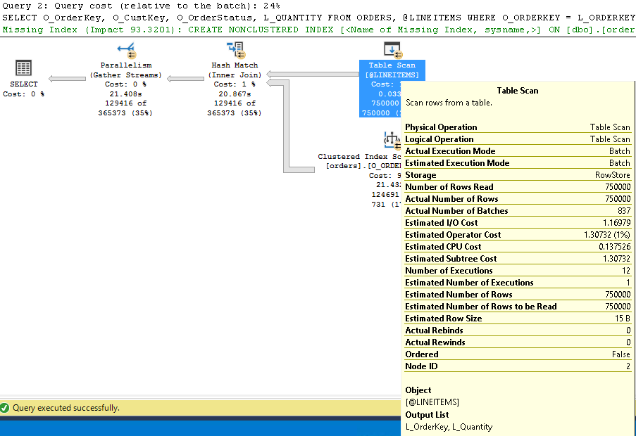

# Intelligent Query Processing Lab 

## Intro - Defining the problem and goal
 [Intelligent query processing in SQL databases](https://docs.microsoft.com/sql/relational-databases/performance/intelligent-query-processing) means that critical parallel workloads improve when running at scale, while remaining adaptive to the constantly changing world of data. 

Intelligent Query Processing is available by default on the latest Database Compatibility Level setting and delivers broad impact that improves the performance of existing workloads with minimal implementation effort.

Intelligent Query Processing in SQL Server 2019 expands upon the Adaptive Query Processing feature family in SQL Server 2017. 

The Intelligent Query Processing suite is meant to rectify some of the common query performance problems by taking some automatic corrective approaches during runtime. It leverages a feedback loop based on statistics collected from past executions to improve subsequent executions.  

 

## Lab requirements (pre-installed)
The following are requirements to run this lab:

- SQL Server 2019 is installed. 
- You have installed SQL Server Management Studio.
- Restore the **tpch** and **WideWorldImportersDW** databases to your SQL Server instance. The `WideWorldImportersDW` database is available in https://github.com/Microsoft/sql-server-samples/tree/master/samples/databases/wide-world-importers. The **tpch** database can be procured at http://www.tpc.org.

## Lab

### Batch Mode Memory Grant Feedback (MGF)

Queries may spill to disk or take too much memory based on poor cardinality estimates. MGF will adjust memory grants based on execution feedback, and remove spills to improve concurrency for repeating queries. In SQL Server 2017, MGF was only available for BatchMode (which means Columnstore had to be in use). In SQL Server 2019 and Azure SQL DB, MGF was extended to also work on RowMode which means it's available for all queries running on SQL Server Database Engine.

1. Open SSMS and connect to the SQL Server 2019 instance (default instance). Click on **New Query** or press CTRL+N.

     

2. Setup the database to ensure the latest database compatibility level is set, by running the commands below in the query window:

    ```sql
    USE master;
    GO

    ALTER DATABASE WideWorldImportersDW 
	SET COMPATIBILITY_LEVEL = 150;
    GO

    ALTER DATABASE SCOPED CONFIGURATION CLEAR PROCEDURE_CACHE;
    GO
    ```

3. Simulate an outdated statistics scenario and create a stored procedure, by running the commands below in the query window:

    ```sql
    USE WideWorldImportersDW;
    GO
    
    UPDATE STATISTICS [Fact].[Order] 
    WITH ROWCOUNT = 1, PAGECOUNT = 1;
    GO

    CREATE OR ALTER PROCEDURE dbo.StockItems
    AS
    SELECT [Color], SUM([Quantity]) AS SumQty
    FROM [Fact].[Order] AS [fo]
    INNER JOIN [Dimension].[Stock Item] AS [si] 
        ON [fo].[Stock Item Key] = [si].[Stock Item Key]
    GROUP BY  [Color];
    GO
    ```

4. For the next steps, looking at the query execution plan is needed. Click on **Include Actual Plan** or press CTRL+M.

     

5. Execute the stored procedure once, by running the command below in the query window: 

    ```sql
    EXEC dbo.StockItems;
    ```

6. Notice the query execution plan, namely the yellow warning sign over the join. Hovering over exposes a number of properties such as the details of a spill to TempDB, which slowed down the query's performance. Spills happen when the granted query memory was not enough to process entirely in memory.

     

7. Right-click the query execution plan root node - the **SELECT** - and click on **Properties**.     
    In the ***Properties*** window, expand **MemoryGrantInfo**. Note that:
    - The property ***LastRequestedMemory*** is zero because this is the first execution. 
    - The current status of whether this query has been adjusted by MGF is exposed by the ***IsMemoryGrantFeedbackAdjusted*** property. In this case value is **NoFirstExecution**. This means there was no adjustment because it is the 1st time the query is executing.

     

8. Execute the stored procedure again. 

9. Click on the query execution plan root node - the **SELECT**. Observe:
    - The ***IsMemoryGrantFeedbackAdjusted*** property value is **YesAdjusting**.
    - The ***LastRequestedMemory*** property is now populated with the previous requested memory grant. 
    - The ***GrantedMemory*** property is greater than the ***LastRequestedMemory*** property. This indicates that more memory was granted, although the spill might still occur, which means SQL Server is still adjusting to the runtime feedback.

10. Execute the stored procedure again, and repeat until the yellow warning sign over the join disappears. This will indicate that there are no more spills. Then execute one more time.

11. Click on the query execution plan root node - the **SELECT**. Observe:
    - The ***IsMemoryGrantFeedbackAdjusted*** property value is **YesStable**.
    - The ***GrantedMemory*** property is now the same as the ***LastRequestedMemory*** property. This indicates that the optimal memory grant was found and adjusted by MGF.

Note that different parameter values may also require different query plans in order to remain optimal. This type of query is defined as **parameter-sensitive**. For parameter-sensitive plans (PSP), MGF will disable itself on a query if it has unstable memory requirements over a few executions.

### Table Variable (TV) Deferred Compilation

Table Variables are suitable for small intermediate result sets, usually no more than a few hundred rows. However, if these constructs have more rows, the legacy behavior of handling a TV is prone to performance issues.    

The legacy behavior mandates that a statement that references a TV is compiled along with all other statements, before any statement that populates the TV is executed. Because of this, SQL Server estimates that only 1 rows would be present in a TV at compilation time.    

Starting with SQL Server 2019, the behavior is that the compilation of a statement that references a TV that doesn’t exist is deferred until the first execution of the statement. This means that SQL Server estimates more accurately and produces optimized query plans based on the actual number of rows in the TV in its first execution.

1. Open SSMS and connect to the SQL Server 2019 instance (default instance). Click on **New Query** or press CTRL+N.

     

2. Setup the database to ensure the database compatibility level of SQL Server 2017 is set, by running the commands below in the query window:

    > **Note:**
    > This ensures the database engine behavior related to Table Variables is mapped to a version lower than SQL Server 2019.

    ```sql
    USE master;
    GO

    ALTER DATABASE [tpch10g-btree] 
    SET COMPATIBILITY_LEVEL = 140;
    GO
    ```

4. For the next steps, looking at the query execution plan is needed. Click on **Include Actual Plan** or press CTRL+M.

     

5. Execute the command below in the query window: 

    > **Note:**
    > This should take between 1 and 5 minutes.

    ```sql
    USE [tpch10g-btree];
    GO

    DECLARE @LINEITEMS TABLE 
	(
        L_OrderKey INT NOT NULL,
	    L_Quantity INT NOT NULL
	);

    INSERT @LINEITEMS
    SELECT TOP 750000 L_OrderKey, L_Quantity
    FROM dbo.lineitem
    WHERE L_Quantity = 43;

    SELECT O_OrderKey, O_CustKey, O_OrderStatus, L_QUANTITY
    FROM ORDERS, @LINEITEMS
    WHERE O_ORDERKEY = L_ORDERKEY
        AND O_OrderStatus = 'O';
    GO
    ```

6. Observe the shape of the query execution plan, that it is a serial plan, and that Nested Loops Joins were chosen given the estimated low number of rows.

7. Click on the **Table Scan** operator in the query execution plan, and hover your mouse over the operator. Observe:
    - The ***Actual Number of Rows*** is 750000.
    - The ***Estimated Number of Rows*** is 1. 
    This indicates the legacy behavior of misusing a TV, with the huge estimation skew.

     


8. Setup the database to ensure the latest database compatibility level is set, by running the commands below in the query window:

    > **Note:**
    > This ensures the database engine behavior related to Table Variables is mapped to SQL Server 2019.

    ```sql
    USE master;
    GO

    ALTER DATABASE [tpch10g-btree] 
    SET COMPATIBILITY_LEVEL = 150;
    GO
    ```

9. Execute the same command as step 5. 

10. Observe the shape of the query execution plan now, that it is a parallel plan, and that a single Hash Joins was chosen given the estimated high number of rows.

11. Click on the **Table Scan** operator in the query execution plan, and hover your mouse over the operator. Observe:
    - The ***Actual Number of Rows*** is 750000.
    - The ***Estimated Number of Rows*** is 750000. 
    This indicates the new behavior of TV deferred compilation, with no estimation skew and a better query execution plan, which also executed much faster (~20 seconds).

     

### Batch Mode on Rowstore

TBA