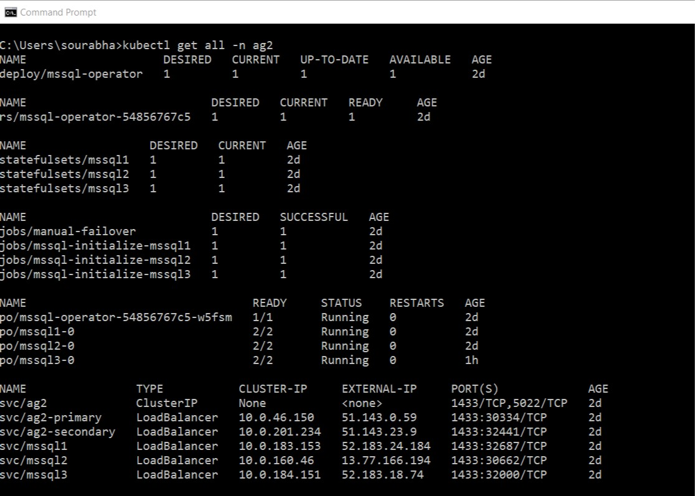

## SQL Server High Availability On Kubernetes Lab

1. Connect to the kubernetes Kubernetes Cluster using Azure CLI and Kubectl.exe

    1. Connect to the WIndows VM in the lab. 
    
    2. Open a command prompt window and execute the below command.
    
       `az login`
     
       Running the above command will open the Azure sign-in page. Sign-in using the Azure Credentials from the **resources tab of the On-Demand Lab Window**. *Please **DO NOT** use your Corp Credentials for this connection*. 
       
       Using the information from the resources section of the labs, set Azure CLI default resource group and subscription names. Please replace *Subscription_Name_From_Resources_Tab* and *Resource_Group_Name_Resources_Tab* in the below commands with the actual subscription and 
       
       `az account set -s Subscription_Name_From_Resources_Tab`
       
       `az configure --defaults group= Resource_Group_Name_From_Resources_Tab`
       
     3. Get details of the kubernetes cluster using Azure CLI. In the same command window as above, execute the following command 
     
        `az aks list -o table `
        
        From the outout of the command above note down the name (output of the Name column) of the Kubernetes Managed Service.
        
     4. Execute the command below to get the access credentials of the managed kubernetes service cluster. Please replace the *Resource_Group_Name* and *Kubernetes_Cluster_Name* with the correct Resource_Group_Name and Kubernetes_Cluster_Name.
     
        `az aks get-credentials --resource-group=Resource_Group_Name --name=Kubernetes_Cluster_Name`
        

2. Deploying SQL Server pods using kubectl and the SQL manifest file. For this deployment you'll be using the `SQl_Server_Deployment.yaml` file. This file is present in the following folder `C:\Labs\Lab-Kubernetes\`. 
 
    1. Create Kubernetes secret for SQL Server SA password and Master Key Password. All SQL Server Pods use these passwords. In the following commands replace "YourStrongPassword" with a valid Strong Password within double quotes "":
  
        `kubectl create namespace ag1`   
          
        `kubectl create secret generic sql-secrets --from-literal=sapassword= <YourStrongPassword> --from-literal=masterkeypassword=<YourStrongPassword> -n ag1`
      
        > **Note:** This deployment uses Namespace ag1. If you'd like to use a different namespace, replace the namespace name "ag1" with a name of your choosing. 
  
    2. Deploy SQL Server pods using the `SQL_Server_Deployment.yaml` file. Deploy the SQL Server pods in the same namespace as the previous step. The default deployment uses namespace *ag1*. If you are using a different namespace, open the `SQL_Server_Deployment.yaml` file and replace **ALL** occurrences of "ag1".

        `Kubectl apply -f "C:\Labs\Lab-Kubernetes\SQl_Server_Deployment.yaml" -n ag1`
  
        > **Note:** The script creates the SQL Server operator along with 3 SQL Server Pods with an Availability Group.     
        > The script also creates 5 kubernetes service (3 for the SQL Server pods, 1 for AG Primary Replica and 1 for AG Secondary Replica).    
        > The Primary Replica Service provides the same functionality as an AG listener, while the secondary replica service provides load balancing capability across the readable secondaries.    
        > It may take a few minutes (generally less than 5 minutes) for the entire deployment to finish.

    3. Execute the below command to get a list of all the deployments in your namespace: 
    
        `kubectl get all -n ag1`
        
        
     
     >Note: Since deployment can take a few minutes, please run the `Kubectl get all' again if you do not see the containers running or the external IP's assigned. 
    
3. Connect to the SQL Server Primary Replica to create a database and add the database to the Availability Group.

    From the output of above command, identify the External IP address associated with the AG primary replica service.    
    The Service has the following naming convention - **svc/AGName-primary**.    
    Connect to the external IP using SSMS or Azure Data Studio. To connect, please use SQL Authentication with login "sa" and the SAPASSWORD used in the step 2.1
  
    Open a new query window and run the following commands:
    
    ```SQL
    CREATE DATABASE TestDB1
    
    GO
    
    ALTER DATABASE TestDB1 SET RECOVERY FULL
    
    GO
    
    BACKUP DATABASE TestDB1 TO DISK = 'Nul'
    
    GO
    
    ALTER AVAILABILITY GROUP <AG_Name> ADD DATABASE TestDB1
    
    GO
    ```

    > **Note:** Replace the *AG_Name* in the script above with the name of your Availability Group. If you didn't make any changes to the yaml file, then replace *AG_Name* with AG1.
    
   The script above creates a Database *TestDB1* on the Primary Replica of the AG and adds the database to the Availability Group.
 
4. Initiate Automatic Failover of the AG by crashing the Primary Replica of the AG. 
 
    Connect to the Primary Replica of the AG using the primary service IP and execute the below query:

    ```SQL
    SELECT @@SERVERNAME
    GO
    ```
 
    From a cmd window, execute the below command to crash the primary replica pod:
 
    `kubectl delete pod <primary_replica_pod_name> -n <namespace_name>`
    
    > **Note:** Please replace the Primary Replica Name from the output of the previous command. Also replace the <namespace_name> with the name of your namespace. 
    
    Killing the primary replica pod will initiate an automatic Failover of the AG to one of the synchronous secondary replicas. Reconnect to the Primary Replica IP and execute the below command again: 
    
    ```SQL
    SELECT @@SERVERNAME
    GO
    ```
    
    In the output you'll notice that the Primary Replica is now hosted on a different SQL Server Pod. 

## Conclusion 

In this lab you created a SQL Server Availability Group deployment with three replicas on a AKS kubernetes cluster. You also tested the automatic failover of the AG by crashing the primary replica of the AG. 
